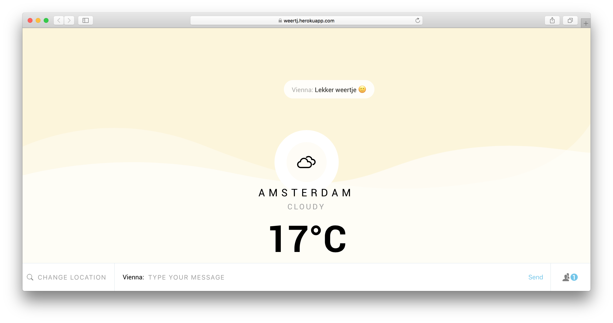
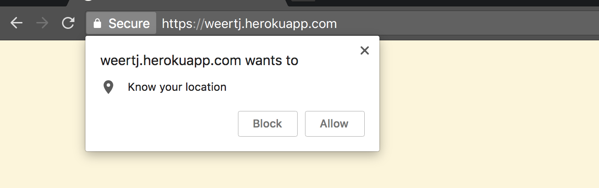
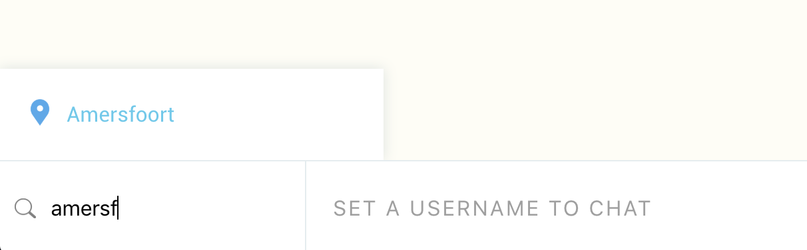
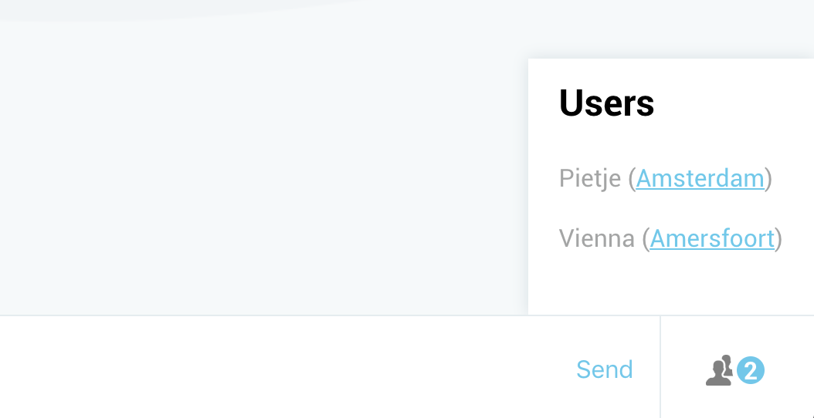
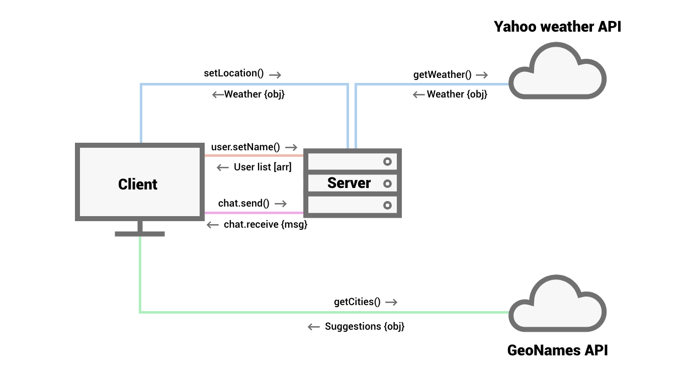
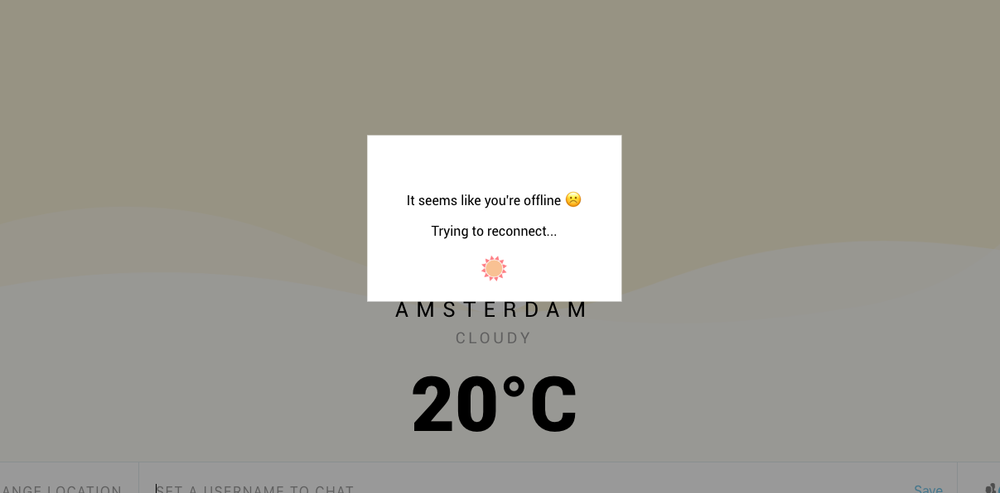

# Weather

This real-time web app makes it possible to discuss the weather online. In this project I use the [Yahoo Weather API](https://developer.yahoo.com/weather/) to get current weather info and [GeoNames](http://www.geonames.org/) to get place name suggestions.

Live demo: [here](https://weertj.herokuapp.com/)



## Table of Contents
- [Weather](#weather)
  * [Setup](#setup)
  * [Features](#features)
    + [Current location](#current-location)
    + [Change location](#change-location)
    + [User list](#user-list)
  * [External sources](#external-sources)
    + [Yahoo Weather API](#yahoo-weather-api)
    + [GeoNames](#geonames)
  * [Data life cycle](#data-life-cycle)
  * [Wishlist](#wishlist)
  * [Sources](#sources)
  * [License](#license)


## Setup

**Prerequisites:**
- Git
- Node
- Npm

To install this project:
1. Clone this repository and navigate to it
2. Run `npm install`
3. Run `gulp` for development, or `npm start` for production.
4. Navigate to [http://localhost:8001/](http://localhost:8001/)

## Features

### Current location 
To get the weather info from the current location, I'm using the [Geolocation.getCurrentPosition()](https://developer.mozilla.org/en-US/docs/Web/API/Geolocation/getCurrentPosition) function. The client will be asked to share it's current location. When the current location is not available, Amsterdam will be picked for the first shown location.



### Change location
To change your location, you can simply type in a new city name in the 'Change location' input. You'll get suggestions for city names while typing. The chosen city will be set in the URL as path name.



### User list
When the user sets a username to chat, he'll appear in the user list with his current location. So you can 'follow' other users to different locations and chat with them.



## External sources

### Yahoo Weather API
The most important external source is [Yahoo Weather API](https://developer.yahoo.com/weather/). Weather information is collected by calling this end point:
```
https://query.yahooapis.com/v1/public/yql?q=select * from weather.forecast where woeid in (select woeid from geo.places(1) where text="${location}") and u='c'&format=json
```
There is no API key needed, so the server can call this API as often as needed.

### GeoNames
For the city names suggestion list I'm using the [GeoNames](http://www.geonames.org/) API. I can make 30000 requests a day with the following end point:
```
http://api.geonames.org/search?name_startsWith=${input}&style=short&cities=cities1000&orderby=relevance&type=json&maxRows=5&username=vienna`
```
It doesn't matter when I've reached the limit, because it's not the main function of the app.

## Data life cycle
The used data doesn't require to be remembered or stored in a database. Everything is based on real-time. 



## User feedback

### Offline
When a client is offline, an error message will be shown. As soon as the clients goes online again, the message will dissappear.



### API error
If the city the user submitted can't be found, an error message will appear.


## Wishlist
- [ ] Use socket.io rooms

- [ ] Add avatars

- [ ] Update live location

## Sources
- [https://socket.io/](https://socket.io/)
- [https://developer.yahoo.com/weather/](https://developer.yahoo.com/weather/)
- [http://www.geonames.org/](http://www.geonames.org/)

## License
[MIT License](https://mit-license.org/)
